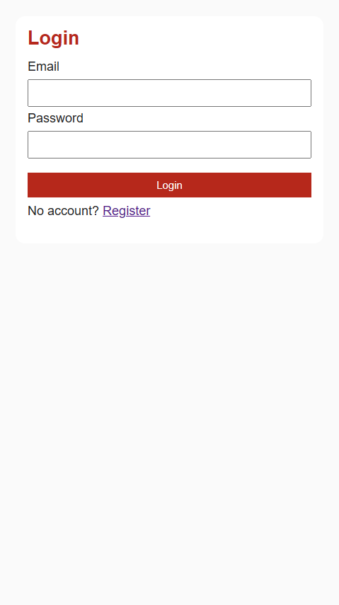
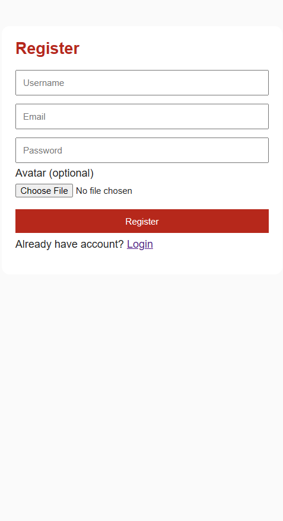
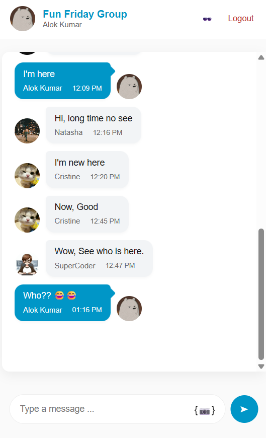

# Alignbox Chat App

A simple and effective chat application built with JavaScript, HTML, and CSS. This project allows users to communicate in real time, designed for easy deployment and customization.

## Features

- Real-time chat functionality
- User authentication (if implemented)
- Clean and responsive UI
- Easy to deploy and customize

## Screenshots

### Login Page



### Registration Page



### Chat Interface



## Installation

Follow these steps to set up the Alignbox Chat App locally:

1. **Clone the repository:**
   ```bash
   git clone https://github.com/alokkumar777/alignbox-chatapp.git
   cd alignbox-chatapp
   ```
